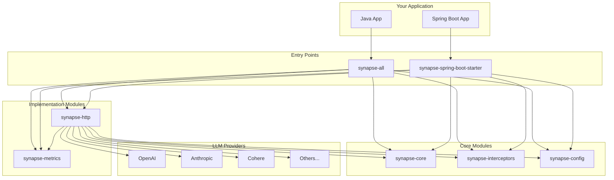
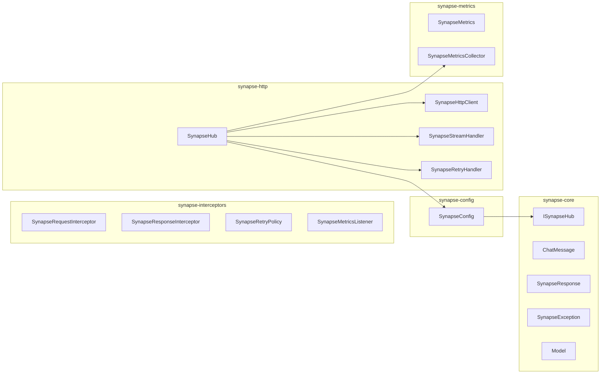
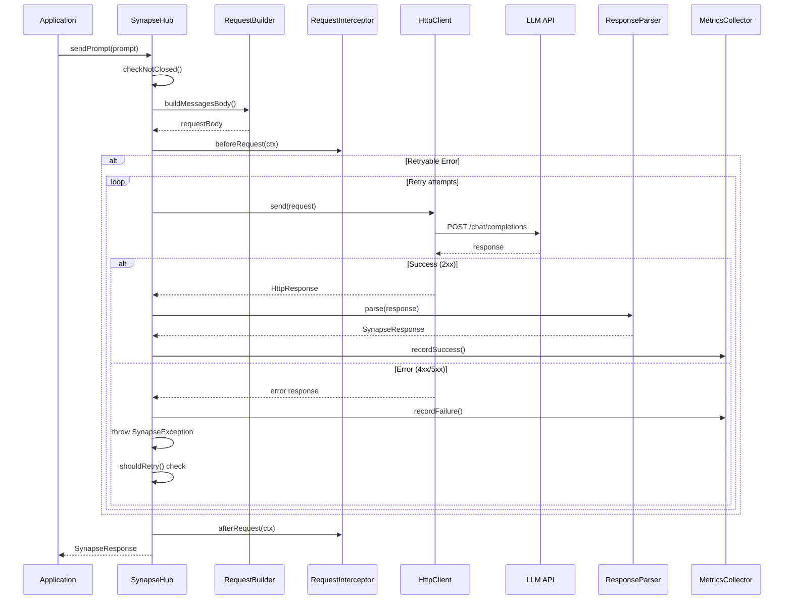
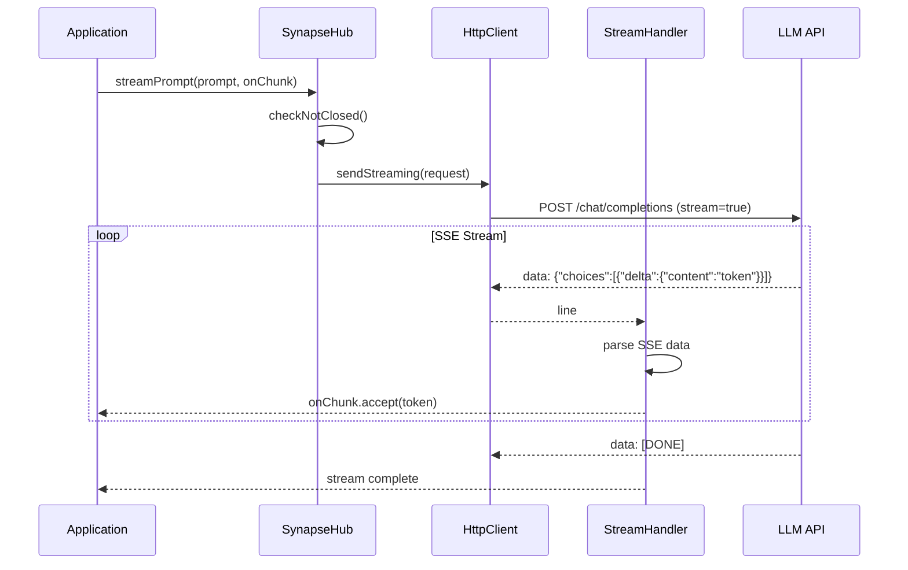
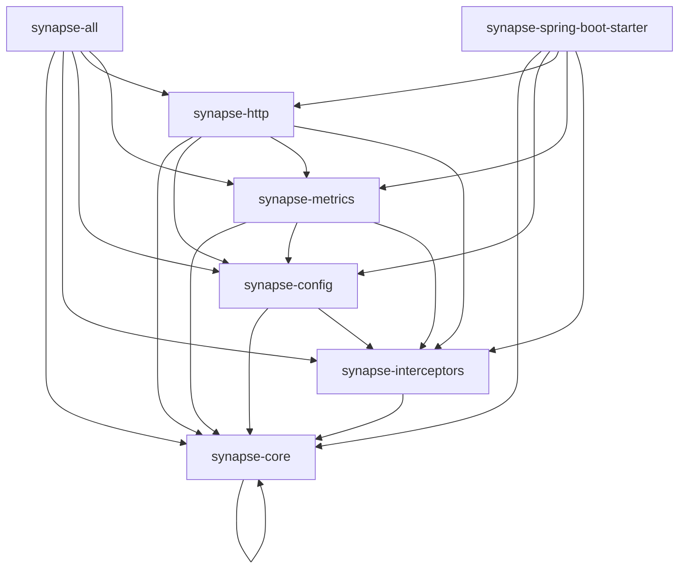
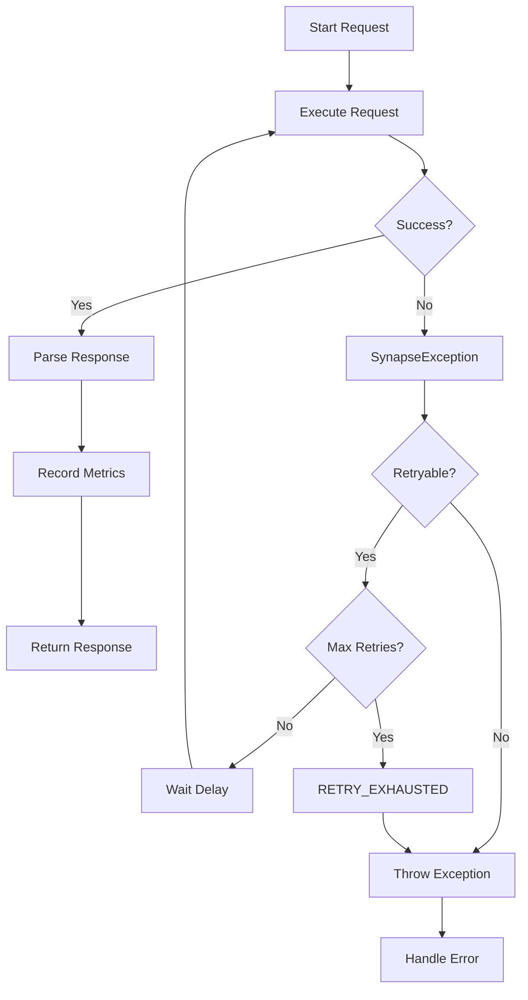

# Synapse

[](https://jitpack.io/#Abhiramrathod/synapse)

A production-ready, multi-module Java library for seamless integration with any LLM API provider.

## Overview

Synapse provides a clean, extensible abstraction layer for interacting with Large Language Model APIs. Whether you're using OpenAI, Anthropic, Cohere, or any other provider, Synapse offers a unified interface with explicit control over synchronous and streaming operations.

### Key Features

- **Provider Agnostic** - Works with any LLM API that follows the OpenAI-compatible format
- **Explicit Streaming** - Decide per-request whether to use `sendPrompt()` or `streamPrompt()`
- **Modular Architecture** - Pick only what you need via focused Maven modules
- **Interceptor Pattern** - Customize request/response handling with pluggable interceptors
- **Automatic Retry** - Built-in exponential backoff with configurable retry policies
- **Metrics Tracking** - Monitor latency, token usage, and request success rates
- **Spring Boot Integration** - Auto-configuration for Spring Boot applications

## Architecture



## Module Structure



## Class Hierarchy

```mermaid
classDiagram
    class ISynapseHub {
        <<interface>>
        +sendPrompt(String) SynapseResponse
        +sendPrompt(String, String) SynapseResponse
        +sendChat(List~ChatMessage~) SynapseResponse
        +sendChat(List~ChatMessage~, String) SynapseResponse
        +chatCompletion(String) SynapseResponse
        +chatCompletion(String, String) SynapseResponse
        +streamPrompt(String, Consumer~String~)
        +streamPrompt(String, Consumer~String~, String)
        +streamChat(List~ChatMessage~, Consumer~String~)
        +streamChat(List~ChatMessage~, Consumer~String~, String)
        +streamCompletion(String, Consumer~String~)
        +streamCompletion(String, Consumer~String~, String)
        +getModelsList() List~Model~
        +close()
    }
    
    class SynapseHub {
        -SynapseConfig config
        -SynapseHttpClient httpClient
        -SynapseStreamHandler streamHandler
        -SynapseRetryHandler retryHandler
        -SynapseMetricsCollector metricsCollector
        +sendPrompt(String) SynapseResponse
        +sendPrompt(String, String) SynapseResponse
        +sendChat(List~ChatMessage~) SynapseResponse
        +sendChat(List~ChatMessage~, String) SynapseResponse
        +chatCompletion(String) SynapseResponse
        +chatCompletion(String, String) SynapseResponse
        +streamPrompt(String, Consumer~String~)
        +streamPrompt(String, Consumer~String~, String)
        +streamChat(List~ChatMessage~, Consumer~String~)
        +streamChat(List~ChatMessage~, Consumer~String~, String)
        +streamCompletion(String, Consumer~String~)
        +streamCompletion(String, Consumer~String~, String)
        +getModelsList() List~Model~
        +getMetrics() SynapseMetrics
    }
    
    class SynapseConfig {
        -String baseUrl
        -String endpoint
        -String apiKey
        -String modelName
        -SynapseRequestInterceptor requestInterceptor
        -SynapseResponseInterceptor responseInterceptor
        -SynapseRetryPolicy retryPolicy
        -SynapseMetricsListener metricsListener
        +builder() Builder
        +validate()
    }
    
    class AbstractSynapseConfig {
        <<abstract>>
        #double temperature
        #int maxTokens
        #Duration timeout
        #int maxRetries
    }
    
    class ChatMessage {
        -String role
        -String content
        +system(String) ChatMessage
        +user(String) ChatMessage
        +assistant(String) ChatMessage
    }
    
    class SynapseResponse {
        -String content
        -String model
        -int promptTokens
        -int completionTokens
        -String finishReason
    }
    
    class SynapseException {
        -int statusCode
        -String responseBody
        -ExceptionType type
        +isRetryable() boolean
    }
    
    class SynapseRequestInterceptor {
        <<interface>>
        +beforeRequest(SynapseRequestContext)
        +afterRequest(SynapseRequestContext)
        +onError(SynapseRequestContext, SynapseException)
    }
    
    class SynapseResponseInterceptor {
        <<interface>>
        +beforeResponse(SynapseResponseContext)
        +afterResponse(SynapseResponseContext)
        +onError(SynapseResponseContext, SynapseException)
    }
    
    class SynapseRetryPolicy {
        <<interface>>
        +shouldRetry(int, SynapseException) boolean
        +getDelay(int) long
        +getMaxRetries() int
    }
    
    class SynapseMetricsListener {
        <<interface>>
        +onRequestStarted(String)
        +onRequestCompleted(SynapseMetricsSummary)
        +onRequestFailed(SynapseMetricsSummary, SynapseException)
    }
    
    ISynapseHub <|.. SynapseHub
    AbstractSynapseConfig <|-- SynapseConfig
    SynapseRequestInterceptor <|.. LoggingInterceptor
    SynapseResponseInterceptor <|.. ResponseLogger
    SynapseRetryPolicy <|.. CustomRetryPolicy
    SynapseMetricsListener <|.. MetricsListener
```



## Request Flow



## Streaming Flow



## Module Dependencies



## Error Handling Flow



## Requirements

- Java 25+
- Maven 3.8+

## Getting Started

### Installation

#### Pure Java

Single dependency for all Synapse modules:

```xml
<!-- JitPack -->
<repository>
    <id>jitpack.io</id>
    <url>https://jitpack.io</url>
</repository>

<!-- Dependency -->
<dependency>
    <groupId>com.github.Abhiramrathod</groupId>
    <artifactId>synapse-all</artifactId>
    <version>v1.0.4</version>
</dependency>
```

#### Spring Boot

Single dependency with auto-configuration:

```xml
<!-- JitPack -->
<repository>
    <id>jitpack.io</id>
    <url>https://jitpack.io</url>
</repository>

<!-- Dependency -->
<dependency>
    <groupId>com.github.Abhiramrathod</groupId>
    <artifactId>synapse-spring-boot-starter</artifactId>
    <version>v1.0.4</version>
</dependency>
```

#### Using Maven Wrapper (mvnw)

```bash
# Build the project
./mvnw clean install

# Deploy to JitPack (on tag push)
git tag v1.0.0
git push origin v1.0.0
```

### Quick Start

#### 1. Create Configuration

```java
import org.abhi.synapse.config.SynapseConfig;

SynapseConfig config = SynapseConfig.builder()
        .baseUrl("https://api.openai.com")
        .endpoint("/v1/chat/completions")
        .apiKey("your-api-key")
        .modelName("gpt-4")
        .temperature(0.7)
        .maxTokens(1024)
        .build();
```

#### 2. Create Hub and Send Prompts

```java
import org.abhi.synapse.http.SynapseHub;
import org.abhi.synapse.core.model.SynapseResponse;

try (SynapseHub hub = new SynapseHub(config)) {
    // Simple prompt
    SynapseResponse response = hub.sendPrompt("What is the capital of France?");
    System.out.println(response.getContent());
    
    // Multi-turn conversation
    List<ChatMessage> messages = List.of(
        ChatMessage.system("You are a helpful assistant."),
        ChatMessage.user("Explain quantum computing in simple terms.")
    );
    SynapseResponse chatResponse = hub.sendChat(messages);
    System.out.println(chatResponse.getContent());
}
```

#### 3. Streaming

```java
try (SynapseHub hub = new SynapseHub(config)) {
    // Stream a prompt
    hub.streamPrompt("Write a poem about programming", chunk -> {
        System.out.print(chunk);
    });
    
    // Stream a chat conversation
    hub.streamChat(messages, chunk -> {
        System.out.print(chunk);
    });
}
```

#### 4. List Available Models

```java
try (SynapseHub hub = new SynapseHub(config)) {
    List<Model> models = hub.getModelsList();
    for (Model model : models) {
        System.out.printf("Model: %s (owned by: %s)%n", model.getId(), model.getOwnedBy());
    }
}
```

#### 5. Model Override

```java
try (SynapseHub hub = new SynapseHub(config)) {
    // Use a different model than the configured default
    SynapseResponse response = hub.sendPrompt("Hello", "gpt-3.5-turbo");
    System.out.println(response.getContent());
    
    // Override model for streaming
    hub.streamPrompt("Write a haiku", chunk -> System.out.print(chunk), "gpt-3.5-turbo");
}
```

## Module Details

### synapse-core

The foundation module containing core interfaces and data models.

| Class | Description |
|-------|-------------|
| `ISynapseHub` | Main interface for LLM operations |
| `ChatMessage` | Represents a message in conversation |
| `SynapseResponse` | Response from LLM API |
| `SynapseException` | Custom exception with error types |
| `Model` | Model metadata from `/v1/models` endpoint |

### synapse-interceptors

Defines interceptor contracts for customizing request/response behavior.

| Interface | Description |
|-----------|-------------|
| `SynapseRequestInterceptor` | Intercept requests before/after sending |
| `SynapseResponseInterceptor` | Intercept responses from LLM |
| `SynapseRetryPolicy` | Custom retry logic |
| `SynapseMetricsListener` | Listen to metrics events |

### synapse-config

Configuration management with builder pattern.

| Class | Description |
|-------|-------------|
| `SynapseConfig` | Main configuration class with builder |

### synapse-http

HTTP transport layer and orchestration.

| Class | Description |
|-------|-------------|
| `SynapseHub` | Main implementation of `ISynapseHub` |
| `SynapseHttpClient` | HTTP client wrapper |
| `SynapseStreamHandler` | SSE stream processing |
| `SynapseRetryHandler` | Retry with exponential backoff |
| `SynapseRequestBuilder` | Request construction |
| `SynapseResponseParser` | Response parsing |

### synapse-metrics

Metrics collection and tracking.

| Class | Description |
|-------|-------------|
| `SynapseMetrics` | In-memory metrics storage |
| `SynapseMetricsCollector` | Collects and records metrics |

### synapse-spring-boot-starter

Spring Boot auto-configuration.

| Class | Description |
|-------|-------------|
| `SynapseAutoConfiguration` | Auto-configures beans |
| `SynapseProperties` | Configuration properties binding |

## Advanced Usage

### Custom Request Interceptor

```java
import org.abhi.synapse.interceptors.SynapseRequestInterceptor;
import org.abhi.synapse.core.model.SynapseRequestContext;

public class LoggingInterceptor implements SynapseRequestInterceptor {
    
    @Override
    public void beforeRequest(SynapseRequestContext ctx) {
        System.out.println("Sending request to: " + ctx.getUrl());
        System.out.println("Headers: " + ctx.getHeaders());
    }
    
    @Override
    public void afterRequest(SynapseRequestContext ctx) {
        System.out.println("Request completed for: " + ctx.getUrl());
    }
    
    @Override
    public void onError(SynapseRequestContext ctx, SynapseException error) {
        System.err.println("Request failed: " + error.getMessage());
    }
}
```

### Custom Retry Policy

```java
import org.abhi.synapse.interceptors.SynapseRetryPolicy;
import org.abhi.synapse.core.exception.SynapseException;

public class CustomRetryPolicy implements SynapseRetryPolicy {
    
    @Override
    public boolean shouldRetry(int attempt, SynapseException error) {
        // Only retry on rate limit or server errors
        return error.getType() == SynapseException.ExceptionType.RATE_LIMIT_ERROR
                || error.getType() == SynapseException.ExceptionType.SERVER_ERROR;
    }
    
    @Override
    public long getDelay(int attempt) {
        // Exponential backoff: 1s, 2s, 4s
        return 1000L * (long) Math.pow(2, attempt);
    }
    
    @Override
    public int getMaxRetries() {
        return 3;
    }
}
```

### Metrics Listener

```java
import org.abhi.synapse.interceptors.SynapseMetricsListener;
import org.abhi.synapse.core.model.SynapseMetricsSummary;

public class MetricsListener implements SynapseMetricsListener {
    
    @Override
    public void onRequestCompleted(SynapseMetricsSummary summary) {
        System.out.printf("Request to %s completed in %dms - %d prompt tokens, %d completion tokens%n",
                summary.getModel(),
                summary.getLatencyMs(),
                summary.getPromptTokens(),
                summary.getCompletionTokens());
    }
    
    @Override
    public void onRequestFailed(SynapseMetricsSummary summary, SynapseException error) {
        System.err.printf("Request to %s failed: %s%n",
                summary.getModel(),
                error != null ? error.getMessage() : "Unknown error");
    }
}
```

### Full Configuration Example

```java
SynapseConfig config = SynapseConfig.builder()
        .baseUrl("https://api.openai.com")
        .endpoint("/v1/chat/completions")
        .apiKey(System.getenv("OPENAI_API_KEY"))
        .modelName("gpt-4")
        .temperature(0.7)
        .maxTokens(2048)
        .timeout(Duration.ofSeconds(30))
        .maxRetries(3)
        .retryDelay(Duration.ofMillis(500))
        .enableLogging(true)
        .requestInterceptor(new LoggingInterceptor())
        .responseInterceptor(new ResponseLogger())
        .retryPolicy(new CustomRetryPolicy())
        .metricsListener(new MetricsListener())
        .build();
```

## Spring Boot Integration

### Add Dependency

```xml
<dependency>
    <groupId>org.abhi</groupId>
    <artifactId>synapse-spring-boot-starter</artifactId>
</dependency>
```

### Configure Application Properties

```yaml
# application.yml
synapse:
  base-url: https://api.openai.com
  endpoint: /v1/chat/completions
  api-key: ${OPENAI_API_KEY}
  model-name: gpt-4
  temperature: 0.7
  max-tokens: 1024
  timeout: 30s
  max-retries: 3
  retry-delay: 500ms
  enable-logging: true
```

### Inject and Use

```java
@Service
public class LlmService {
    
    private final ISynapseHub synapseHub;
    
    public LlmService(ISynapseHub synapseHub) {
        this.synapseHub = synapseHub;
    }
    
    public String askQuestion(String question) {
        SynapseResponse response = synapseHub.sendPrompt(question);
        return response.getContent();
    }
}
```

### Using Interceptors in Spring Boot

#### 1. Create Interceptor as Component

```java
package com.example.synapse.interceptors;

import org.abhi.synapse.interceptors.SynapseRequestInterceptor;
import org.abhi.synapse.interceptors.SynapseResponseInterceptor;
import org.abhi.synapse.interceptors.SynapseRetryPolicy;
import org.abhi.synapse.interceptors.SynapseMetricsListener;
import org.abhi.synapse.core.model.SynapseRequestContext;
import org.abhi.synapse.core.model.SynapseResponseContext;
import org.abhi.synapse.core.model.SynapseMetricsSummary;
import org.abhi.synapse.core.exception.SynapseException;
import org.springframework.stereotype.Component;

@Component
public class LoggingRequestInterceptor implements SynapseRequestInterceptor {
    
    @Override
    public void beforeRequest(SynapseRequestContext ctx) {
        System.out.println("[Synapse] Request to: " + ctx.getUrl());
    }
    
    @Override
    public void afterRequest(SynapseRequestContext ctx) {
        System.out.println("[Synapse] Request completed: " + ctx.getUrl());
    }
    
    @Override
    public void onError(SynapseRequestContext ctx, SynapseException error) {
        System.err.println("[Synapse] Request failed: " + error.getMessage());
    }
}

@Component
public class MetricsResponseInterceptor implements SynapseResponseInterceptor {
    
    @Override
    public void afterResponse(SynapseResponseContext ctx) {
        System.out.printf("[Synapse] Response in %dms (status: %d)%n",
                ctx.getLatencyMs(), ctx.getStatusCode());
    }
}

@Component
public class CustomRetryPolicy implements SynapseRetryPolicy {
    
    @Override
    public boolean shouldRetry(int attempt, SynapseException error) {
        return error.getType() == SynapseException.ExceptionType.RATE_LIMIT_ERROR
                || error.getType() == SynapseException.ExceptionType.SERVER_ERROR;
    }
    
    @Override
    public long getDelay(int attempt) {
        return 1000L * (long) Math.pow(2, attempt);
    }
    
    @Override
    public int getMaxRetries() {
        return 3;
    }
}

@Component
public class LoggingMetricsListener implements SynapseMetricsListener {
    
    @Override
    public void onRequestCompleted(SynapseMetricsSummary summary) {
        System.out.printf("[Synapse] %s - %dms, %d tokens%n",
                summary.getModel(), summary.getLatencyMs(), summary.getTotalTokens());
    }
    
    @Override
    public void onRequestFailed(SynapseMetricsSummary summary, SynapseException error) {
        System.err.printf("[Synapse] %s failed: %s%n",
                summary.getModel(), error != null ? error.getMessage() : "Unknown");
    }
}
```

#### 2. Register Interceptors via Configuration

```java
package com.example.synapse.config;

import org.abhi.synapse.config.SynapseConfig;
import org.abhi.synapse.interceptors.SynapseRequestInterceptor;
import org.abhi.synapse.interceptors.SynapseResponseInterceptor;
import org.abhi.synapse.interceptors.SynapseRetryPolicy;
import org.abhi.synapse.interceptors.SynapseMetricsListener;
import org.springframework.beans.factory.annotation.Qualifier;
import org.springframework.context.annotation.Bean;
import org.springframework.context.annotation.Configuration;

@Configuration
public class SynapseInterceptorConfig {
    
    @Bean
    public SynapseConfig synapseConfig(
            SynapseProperties properties,
            @Qualifier("loggingRequestInterceptor") SynapseRequestInterceptor requestInterceptor,
            @Qualifier("metricsResponseInterceptor") SynapseResponseInterceptor responseInterceptor,
            @Qualifier("customRetryPolicy") SynapseRetryPolicy retryPolicy,
            @Qualifier("loggingMetricsListener") SynapseMetricsListener metricsListener) {
        
        return SynapseConfig.builder()
                .baseUrl(properties.getBaseUrl())
                .endpoint(properties.getEndpoint())
                .apiKey(properties.getApiKey())
                .modelName(properties.getModelName())
                .temperature(properties.getTemperature())
                .maxTokens(properties.getMaxTokens())
                .requestInterceptor(requestInterceptor)
                .responseInterceptor(responseInterceptor)
                .retryPolicy(retryPolicy)
                .metricsListener(metricsListener)
                .build();
    }
}
```

#### 3. Alternative: Programmatic Registration

```java
@Service
public class LlmService {
    
    private final ISynapseHub synapseHub;
    
    public LlmService(
            SynapseProperties properties,
            SynapseRequestInterceptor requestInterceptor,
            SynapseResponseInterceptor responseInterceptor,
            SynapseRetryPolicy retryPolicy,
            SynapseMetricsListener metricsListener) {
        
        SynapseConfig config = SynapseConfig.builder()
                .baseUrl(properties.getBaseUrl())
                .endpoint(properties.getEndpoint())
                .apiKey(properties.getApiKey())
                .modelName(properties.getModelName())
                .requestInterceptor(requestInterceptor)
                .responseInterceptor(responseInterceptor)
                .retryPolicy(retryPolicy)
                .metricsListener(metricsListener)
                .build();
        
        this.synapseHub = new SynapseHub(config);
    }
    
    public String askQuestion(String question) {
        SynapseResponse response = synapseHub.sendPrompt(question);
        return response.getContent();
    }
}
```

#### 4. Conditional Interceptors

```java
@Configuration
public class ConditionalInterceptorConfig {
    
    @Bean
    @ConditionalOnProperty(name = "synapse.interceptors.logging.enabled", havingValue = "true")
    public SynapseRequestInterceptor loggingRequestInterceptor() {
        return new LoggingRequestInterceptor();
    }
    
    @Bean
    @ConditionalOnProperty(name = "synapse.interceptors.metrics.enabled", havingValue = "true")
    public SynapseMetricsListener metricsListener() {
        return new LoggingMetricsListener();
    }
}
```

## Error Handling

Synapse provides a structured exception hierarchy with `SynapseException`:

```java
try {
    SynapseResponse response = hub.sendPrompt("Hello");
} catch (SynapseException e) {
    switch (e.getType()) {
        case RATE_LIMIT_ERROR:
            // Handle rate limiting
            break;
        case SERVER_ERROR:
            // Handle server errors
            break;
        case NETWORK_ERROR:
            // Handle network issues
            break;
        case TIMEOUT_ERROR:
            // Handle timeout
            break;
        default:
            // Handle other errors
    }
    
    if (e.isRetryable()) {
        // Automatically retried based on retry policy
    }
}
```

## Exception Types

| Type | Description | Retryable |
|------|-------------|-----------|
| `CONFIG_ERROR` | Configuration validation failed | No |
| `NETWORK_ERROR` | Network connectivity issues | Yes |
| `TIMEOUT_ERROR` | Request timeout | Yes |
| `RATE_LIMIT_ERROR` | API rate limit exceeded | Yes |
| `SERVER_ERROR` | LLM API server error | Yes |
| `PARSE_ERROR` | Response parsing failed | No |
| `STREAMING_ERROR` | Streaming connection error | No |
| `RETRY_EXHAUSTED` | Max retries exceeded | No |

## CI/CD

This project uses GitHub Actions for continuous integration with automatic versioning.

### Workflow

| Trigger | Description |
|---------|-------------|
| Push to main | Builds, tests, auto-creates incrementing tag |
| Manual dispatch | Same as push to main |

### How It Works

1. **Push to main** triggers the workflow
2. **Build job** compiles, tests, and packages
3. **Auto-tag job** increments the version tag (e.g., `v1.0.0` → `v1.0.1`)
4. **JitPack** automatically builds the new tag

### Auto-Versioning

Tags auto-increment on each push:
- `v0.0.0` → `v0.0.1` → `v0.0.2` → ...
- To increment minor/major, manually create tag:
  ```bash
  git tag -a v1.0.0 -m "Release 1.0.0"
  git push origin v1.0.0
  ```

### JitPack Integration

This project is available via [JitPack](https://jitpack.io/#Abhiramrathod/synapse).

After tag is created, JitPack builds automatically. Use in your project:

```xml
<repository>
    <id>jitpack.io</id>
    <url>https://jitpack.io</url>
</repository>

<dependency>
    <groupId>com.github.Abhiramrathod</groupId>
    <artifactId>synapse-all</artifactId>
    <version>v1.0.4</version>
</dependency>
```

## Building from Source

```bash
git clone https://github.com/Abhiramrathod/synapse.git
cd synapse
mvn clean install
```

## Building from Source

```bash
git clone https://github.com/Abhiramrathod/synapse.git
mvn clean install
```
