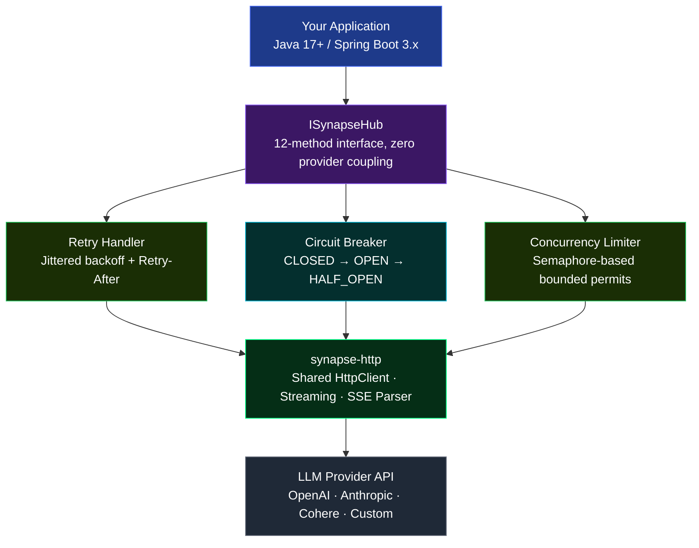
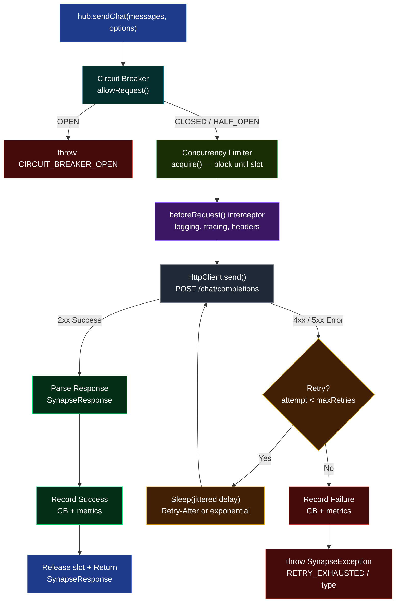
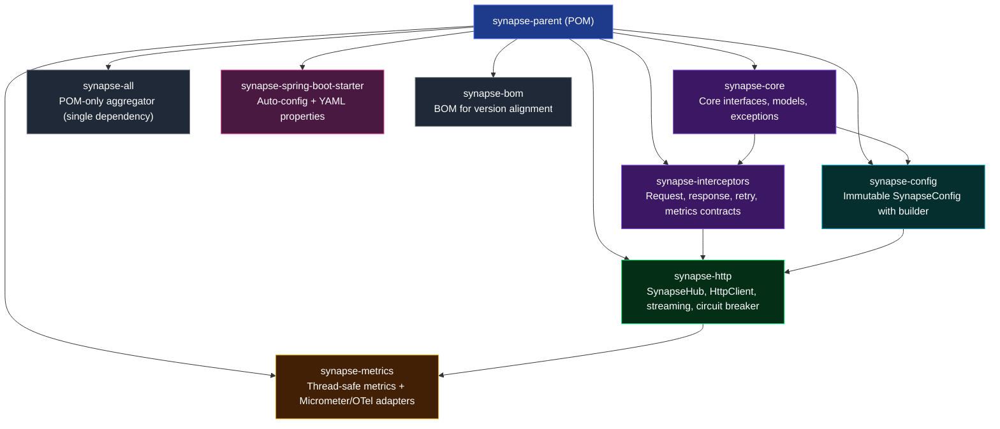
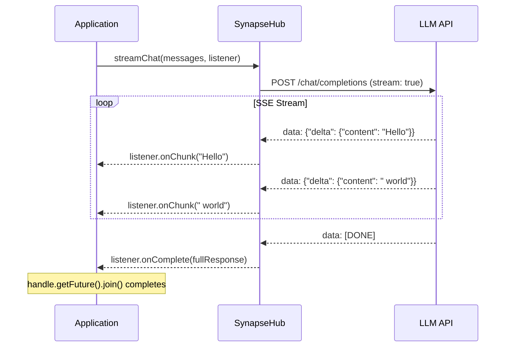

# Synapse

[](https://central.sonatype.com/search?q=org.abhi)
[](LICENSE)
[](https://adoptium.net/)

A production-ready, provider-agnostic Java client for any LLM API. One unified interface for OpenAI, Anthropic, Cohere, and any OpenAI-compatible provider.

## Why Synapse?

| Problem | Synapse Solution |
|---------|-----------------|
| Vendor lock-in | Provider SPI — swap providers with zero code changes |
| No streaming control | `StreamListener` with chunk/complete/error callbacks + cancellation |
| Brittle retry logic | Jittered exponential backoff, Retry-After header parsing, circuit breaker |
| Thread-unsafe metrics | `LongAdder` + `CopyOnWriteArrayList` — safe under concurrent load |
| Secrets in logs | `toString()` masks API keys and Authorization headers |
| Timeout misconfiguration | Split timeouts: connect, read, overall deadline, stream idle |

## Architecture



## Request Flow



## Module Structure



| Module | Key Classes | Purpose |
|--------|-------------|---------|
| `synapse-core` | `ISynapseHub`, `ChatMessage`, `SynapseResponse`, `SynapseException`, `ToolCall`, `RequestOptions`, `StreamListener`, `StreamHandle`, `CancellationToken` | Public API surface |
| `synapse-interceptors` | `SynapseRequestInterceptor`, `SynapseResponseInterceptor`, `SynapseRetryPolicy`, `SynapseMetricsListener` | Extension contracts |
| `synapse-config` | `SynapseConfig` | Immutable config with split timeouts, circuit breaker, rate limit settings |
| `synapse-http` | `SynapseHub`, `CircuitBreaker`, `ConcurrencyLimiter`, `SynapseStreamHandler`, `SynapseRetryHandler` | Full implementation |
| `synapse-metrics` | `SynapseMetrics`, `SynapseMetricsCollector`, `SynapseMicrometerMetricsAdapter`, `SynapseOpenTelemetryExporter` | Metrics collection + export |
| `synapse-spring-boot-starter` | `SynapseAutoConfiguration`, `SynapseProperties` | Spring Boot integration |

## Requirements

- **Java 17+**
- **Maven 3.8+**

## Installation

### Maven

```xml
<repository>
    <id>jitpack.io</id>
    <url>https://jitpack.io</url>
</repository>
```

**Single dependency** — bundles all modules:

```xml
<dependency>
    <groupId>com.github.Abhiramrathod</groupId>
    <artifactId>synapse-all</artifactId>
    <version>TAG</version>
</dependency>
```

**Spring Boot** — auto-configuration + YAML properties:

```xml
<dependency>
    <groupId>com.github.Abhiramrathod</groupId>
    <artifactId>synapse-spring-boot-starter</artifactId>
    <version>TAG</version>
</dependency>
```

**BOM** — align versions across modules:

```xml
<dependency>
    <groupId>com.github.Abhiramrathod</groupId>
    <artifactId>synapse-bom</artifactId>
    <version>TAG</version>
    <type>pom</type>
    <scope>import</scope>
</dependency>
```

## Quick Start

### 1. Configure

```java
import org.abhi.synapse.config.SynapseConfig;

SynapseConfig config = SynapseConfig.builder()
        .baseUrl("https://api.openai.com")
        .endpoint("/v1/chat/completions")
        .apiKey(System.getenv("OPENAI_API_KEY"))
        .modelName("gpt-4")
        .temperature(0.7)
        .maxTokens(1024)
        .build();
```

### 2. Create Hub

```java
import org.abhi.synapse.http.SynapseHub;

SynapseHub hub = new SynapseHub(config);
```

### 3. Call the LLM

**Synchronous:**

```java
SynapseResponse response = hub.sendPrompt("What is Java?", null);
System.out.println(response.getContent());
```

**Multi-turn chat:**

```java
List<ChatMessage> messages = List.of(
    ChatMessage.system("You are a helpful assistant."),
    ChatMessage.user("What is Java?"),
    ChatMessage.assistant("Java is a programming language."),
    ChatMessage.user("How do I install it?")
);

SynapseResponse response = hub.sendChat(messages, null);
System.out.println(response.getContent());
```

**Async:**

```java
CompletableFuture<SynapseResponse> future =
    hub.sendPromptAsync("What is Java?", null);

future.thenAccept(response ->
    System.out.println(response.getContent())
);
```

**Streaming with StreamListener:**

```java
StreamHandle handle = hub.streamPrompt("Write a haiku", new StreamListener() {
    @Override
    public void onChunk(String text) {
        System.out.print(text);  // tokens arrive here
    }

    @Override
    public void onComplete(SynapseResponse fullResponse) {
        System.out.println("\n--- Done ---");
    }

    @Override
    public void onError(SynapseException error) {
        System.err.println("Stream failed: " + error.getMessage());
    }
});

// Cancel mid-stream if needed
// handle.cancel();
```

**Streaming with Consumer (via StreamListener adapter):**

```java
hub.streamPrompt("Write a haiku", StreamListener.of(chunk -> {
    System.out.print(chunk);
}));
```

**Flow.Publisher (reactive):**

```java
Flow.Publisher<String> publisher = hub.streamPromptAsFlow("What is Java?");

publisher.subscribe(new Flow.Subscriber<>() {
    private Flow.Subscription subscription;

    @Override
    public void onSubscribe(Flow.Subscription s) {
        this.subscription = s;
        s.request(Long.MAX_VALUE);
    }

    @Override
    public void onNext(String item) {
        System.out.print(item);
    }

    @Override
    public void onError(Throwable t) { t.printStackTrace(); }

    @Override
    public void onComplete() { System.out.println("\nDone"); }
});
```

### 4. Per-Request Options

Override model, temperature, tools, timeouts, and response format per request:

```java
RequestOptions opts = RequestOptions.defaults()
    .setModelName("gpt-3.5-turbo")
    .setTemperature(0.3)
    .setMaxTokens(512)
    .setTools(List.of(new ToolDefinition("get_weather", "Get current weather")));

SynapseResponse response = hub.sendPrompt("Weather in Tokyo?", opts);
```

### 5. Tool / Function Calling

```java
// Define tools
ToolDefinition weatherTool = new ToolDefinition(
    "get_weather",
    "Get current weather for a location"
);

RequestOptions opts = RequestOptions.defaults()
    .setTools(List.of(weatherTool));

// Send request — model may return tool calls instead of text
SynapseResponse response = hub.sendChat(
    List.of(ChatMessage.user("What's the weather in Paris?")),
    opts
);

if (response.getToolCalls() != null && !response.getToolCalls().isEmpty()) {
    for (ToolCall call : response.getToolCalls()) {
        System.out.println("Tool: " + call.getFunction().getName());
        System.out.println("Args: " + call.getFunction().getArguments());
    }
} else {
    System.out.println(response.getContent());
}

// Send tool result back
ChatMessage toolResult = ChatMessage.tool(
    call.getId(), call.getFunction().getName(), "{\"temp\": 22}");
SynapseResponse followUp = hub.sendChat(
    List.of(
        ChatMessage.user("What's the weather in Paris?"),
        ChatMessage.assistant("").toolCalls(List.of(call)),
        toolResult
    ),
    null
);
```

### 6. List Available Models

```java
List<Model> models = hub.getModelsList();
models.forEach(m ->
    System.out.printf("Model: %s (owned by: %s)%n", m.getId(), m.getOwnedBy())
);
```

### 7. Close

```java
hub.close();  // releases HttpClient, thread pool
// or use try-with-resources (SynapseHub implements AutoCloseable)
```

## Streaming Flow



## Error Handling

```java
try {
    SynapseResponse response = hub.sendPrompt("Hello", null);
} catch (SynapseException e) {
    switch (e.getType()) {
        case RATE_LIMIT_ERROR:
            // 429 — back off, retry later
            break;
        case SERVER_ERROR:
            // 5xx — provider issue
            break;
        case NETWORK_ERROR:
            // Connection refused, DNS failure
            break;
        case TIMEOUT_ERROR:
            // Request exceeded timeout
            break;
        case CIRCUIT_BREAKER_OPEN:
            // Too many failures — wait for half-open
            break;
        case RETRY_EXHAUSTED:
            // All retry attempts failed
            break;
        case STREAMING_ERROR:
            // SSE stream failed (partial content available)
            break;
        default:
            // CONFIG_ERROR, PARSE_ERROR
    }

    if (e.isRetryable()) {
        // Automatically retried by the framework
    }

    // HTTP details
    int status = e.getStatusCode();      // 0 if not HTTP error
    String body = e.getResponseBody();   // null if not available
}
```

| Exception Type | Description | Retryable |
|---------------|-------------|-----------|
| `CONFIG_ERROR` | Configuration validation failed | No |
| `NETWORK_ERROR` | Network connectivity issues | Yes |
| `TIMEOUT_ERROR` | Request timeout | Yes |
| `RATE_LIMIT_ERROR` | API rate limit exceeded (HTTP 429) | Yes |
| `SERVER_ERROR` | LLM API server error (HTTP 5xx) | Yes |
| `PARSE_ERROR` | Response parsing failed | No |
| `STREAMING_ERROR` | Streaming connection error | No |
| `RETRY_EXHAUSTED` | Max retries exceeded | No |
| `CIRCUIT_BREAKER_OPEN` | Circuit breaker is open | No |

## Configuration Reference

```java
SynapseConfig config = SynapseConfig.builder()
        // Required
        .baseUrl("https://api.openai.com")
        .endpoint("/v1/chat/completions")
        .apiKey(System.getenv("OPENAI_API_KEY"))
        .modelName("gpt-4")

        // Tuning
        .temperature(0.7)              // 0.0 - 2.0
        .maxTokens(2048)

        // Timeouts (split)
        .connectTimeout(Duration.ofSeconds(5))
        .readTimeout(Duration.ofSeconds(30))
        .requestTimeout(Duration.ofSeconds(60))   // overall deadline
        .streamIdleTimeout(Duration.ofSeconds(30))

        // Retry
        .maxRetries(3)
        .retryDelay(Duration.ofMillis(500))
        .maxRetryElapsedTime(Duration.ofSeconds(120))

        // Concurrency
        .maxConcurrentRequests(64)
        .maxRequestsPerMinute(0)           // 0 = unlimited

        // Circuit Breaker
        .circuitBreakerFailureThreshold(5)
        .circuitBreakerOpenDuration(Duration.ofSeconds(30))

        // Interceptors
        .requestInterceptor(new LoggingInterceptor())
        .responseInterceptor(new MetricsInterceptor())
        .retryPolicy(new CustomRetryPolicy())
        .metricsListener(new MetricsListener())

        // Misc
        .enableLogging(true)
        .build();
```

## Spring Boot Integration

### application.yml

```yaml
synapse:
  base-url: https://api.openai.com
  endpoint: /v1/chat/completions
  api-key: ${OPENAI_API_KEY}
  model-name: gpt-4
  temperature: 0.7
  max-tokens: 1024
  connect-timeout: 5s
  read-timeout: 30s
  request-timeout: 60s
  stream-idle-timeout: 30s
  max-retries: 3
  retry-delay: 500ms
  max-retry-elapsed-time: 120s
  max-concurrent-requests: 64
  max-requests-per-minute: 0
  circuit-breaker-failure-threshold: 5
  circuit-breaker-open-duration: 30s
  enable-logging: true
```

### Inject ISynapseHub

```java
@Service
public class LlmService {

    private final ISynapseHub synapseHub;

    public LlmService(ISynapseHub synapseHub) {
        this.synapseHub = synapseHub;
    }

    public String askQuestion(String question) {
        SynapseResponse response = synapseHub.sendPrompt(question, null);
        return response.getContent();
    }
}
```

## Interceptors

### Request Interceptor

```java
public class TracingInterceptor implements SynapseRequestInterceptor {

    @Override
    public void beforeRequest(SynapseRequestContext ctx) {
        ctx.getHeaders().put("X-Request-Id", UUID.randomUUID().toString());
    }

    @Override
    public void afterRequest(SynapseRequestContext ctx) { }

    @Override
    public void onError(SynapseRequestContext ctx, SynapseException error) { }
}
```

### Metrics Listener

```java
public class MicrometerListener implements SynapseMetricsListener {

    @Override
    public void onRequestCompleted(SynapseMetricsSummary summary) {
        Timer.builder("synapse.request")
            .tag("model", summary.getModel())
            .register(meterRegistry)
            .record(summary.getLatencyMs(), TimeUnit.MILLISECONDS);
    }

    @Override
    public void onRequestFailed(SynapseMetricsSummary summary, SynapseException error) {
        // record failure metrics
    }
}
```

## Metrics Export

Zero-dep in-memory collector by default. Optional adapters via reflection (no compile-time dependency):

```java
// Micrometer (add micrometer-core as optional dependency)
SynapseMicrometerMetricsAdapter adapter =
    new SynapseMicrometerMetricsAdapter(meterRegistry);
adapter.bind(hub.getMetrics());

// OpenTelemetry (add opentelemetry-api as optional dependency)
SynapseOpenTelemetryExporter exporter =
    new SynapseOpenTelemetryExporter(meterizer);
exporter.bind(hub.getMetrics());
```

## CI/CD

| Trigger | Action |
|---------|--------|
| Push to `master` | Build + test only |
| Semver tag (`v*`) | Full test → package → GitHub Release with auto-generated notes |

```bash
# Create a release
git tag -a v1.0.0 -m "Release 1.0.0"
git push origin v1.0.0
```

## Building from Source

```bash
git clone https://github.com/Abhiramrathod/synapse.git
cd synapse
./mvnw clean install
```

## License

Apache License 2.0
