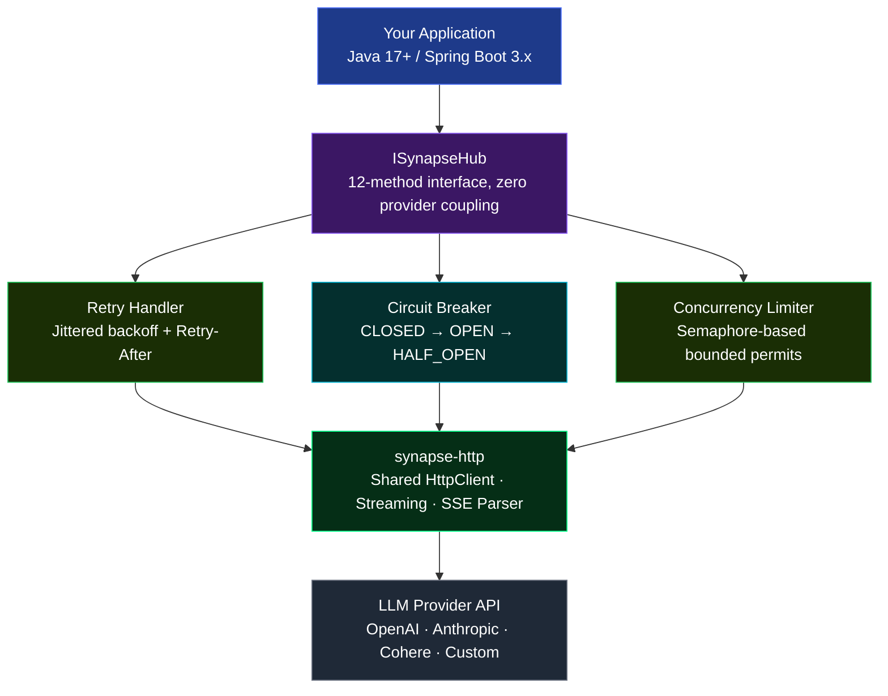
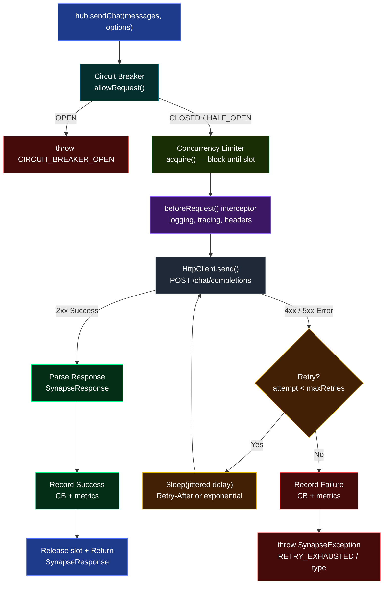
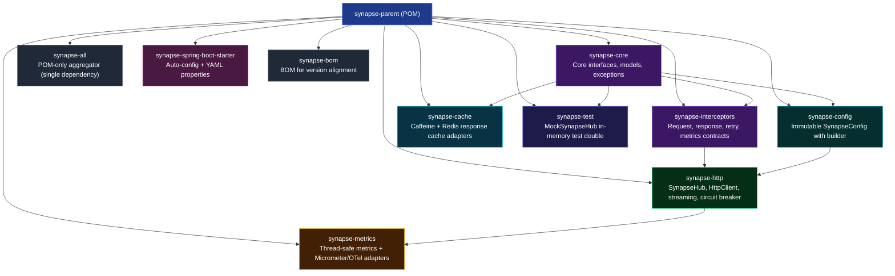
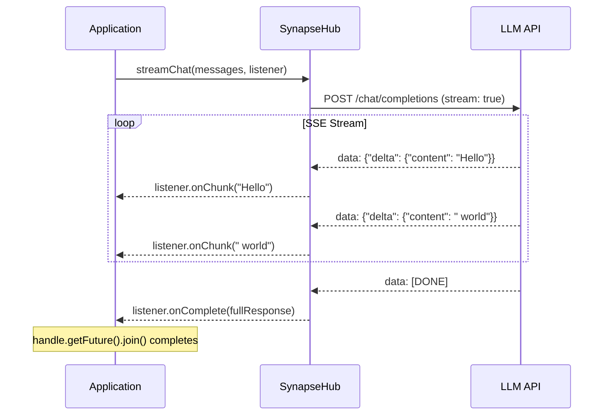

# Synapse

[](https://central.sonatype.com/artifact/io.github.abhiramrathod/synapse-all)
[](LICENSE)
[](https://adoptium.net/)

A production-ready, provider-agnostic Java client for any LLM API. One unified interface for OpenAI, Anthropic, Cohere, and any OpenAI-compatible provider.

## Why Synapse?

| Problem | Synapse Solution |
|---------|-----------------|
| Vendor lock-in | `ProviderAdapter` SPI via `ServiceLoader` — add a provider with one class + one registration file, zero core changes |
| No streaming control | `StreamListener` with chunk/complete/error callbacks + cancellation + `Flow.Publisher` |
| Brittle retry logic | Jittered exponential backoff, Retry-After header parsing, circuit breaker |
| Thread-unsafe metrics | `LongAdder` + `CopyOnWriteArrayList` — safe under concurrent load |
| Secrets in logs | `toString()` masks API keys and Authorization headers |
| Timeout misconfiguration | Split timeouts: connect, read, overall deadline, stream idle |
| Static credentials only | `TokenProvider` SPI — per-request token acquisition for rotating keys, AWS SigV4, Azure Entra ID / Managed Identity |
| Reconfig needs a restart | `SynapseHub.updateApiKey(...)`, `updateBaseUrl(...)`, `reconfigure(...)` etc. — rotate keys, endpoints, and defaults live without tearing down the HTTP client pool |
| Repeated queries burn credits | `ResponseCache` — pluggable Caffeine (in-memory) and Redis (SPI) caches, keyed by model + prompt, with TTL |
| Single provider = single point of failure | `FallbackSynapseHub` + `LoadBalancingSynapseHub` — route around failures or spread load across hubs |
| Streaming boilerplate | `StreamFlow` — filter/map/join/forEach over token streams with zero `Flow.Subscriber` plumbing |

## Architecture



## Request Flow



## Module Structure



| Module | Key Classes | Purpose |
|--------|-------------|---------|
| `synapse-core` | `ISynapseHub`, `ChatMessage`, `SynapseResponse`, `SynapseException`, `ToolCall`, `RequestOptions`, `StreamListener`, `StreamHandle`, `CancellationToken`, `StreamFlow`, `TokenProvider`, `FallbackSynapseHub`, `LoadBalancingSynapseHub`, `ResponseCache`, `NoOpResponseCache` | Public API surface |
| `synapse-interceptors` | `SynapseRequestInterceptor`, `SynapseResponseInterceptor`, `SynapseRetryPolicy`, `SynapseMetricsListener` | Extension contracts |
| `synapse-config` | `SynapseConfig` | Immutable config with split timeouts, circuit breaker, rate limit, caching, and token provider settings |
| `synapse-http` | `SynapseHub`, `ProviderAdapter`/`OpenAiProviderAdapter`, `CircuitBreaker`, `ConcurrencyLimiter`, `SynapseStreamHandler`, `SynapseRetryHandler`, `HubSettings` | Full implementation + dynamic reconfiguration |
| `synapse-metrics` | `SynapseMetrics`, `SynapseMetricsCollector`, `SynapseMicrometerMetricsAdapter`, `SynapseOpenTelemetryExporter` | Metrics collection + export |
| `synapse-spring-boot-starter` | `SynapseAutoConfiguration`, `SynapseProperties` | Spring Boot integration |
| `synapse-cache` | `CaffeineResponseCache`, `RedisResponseCache`, `RedisClient`, `RedisClientProvider` | Pluggable response caches |
| `synapse-test` | `MockSynapseHub` | In-memory hub for unit tests |

## Requirements

- **Java 17+**
- **Maven 3.8+**

## Installation

### Maven

```xml
<repository>
    <id>jitpack.io</id>
    <url>https://jitpack.io</url>
</repository>
```

**Single dependency** — bundles all modules:

```xml
<dependency>
    <groupId>com.github.Abhiramrathod</groupId>
    <artifactId>synapse-all</artifactId>
    <version>TAG</version>
</dependency>
```

**Spring Boot** — auto-configuration + YAML properties:

```xml
<dependency>
    <groupId>com.github.Abhiramrathod</groupId>
    <artifactId>synapse-spring-boot-starter</artifactId>
    <version>TAG</version>
</dependency>
```

**BOM** — align versions across modules:

```xml
<dependency>
    <groupId>com.github.Abhiramrathod</groupId>
    <artifactId>synapse-bom</artifactId>
    <version>TAG</version>
    <type>pom</type>
    <scope>import</scope>
</dependency>
```

**Caching adapters** — only needed if you use individual modules instead of
`synapse-all`:

```xml
<dependency>
    <groupId>com.github.Abhiramrathod</groupId>
    <artifactId>synapse-cache</artifactId>
    <version>TAG</version>
</dependency>
```

## Quick Start

### 1. Configure

```java
import org.abhi.synapse.config.SynapseConfig;

SynapseConfig config = SynapseConfig.builder()
        .baseUrl("https://api.openai.com")
        .endpoint("/v1/chat/completions")
        .apiKey(System.getenv("OPENAI_API_KEY"))
        .modelName("gpt-4")
        .temperature(0.7)
        .maxTokens(1024)
        .build();
```

### 2. Create Hub

```java
import org.abhi.synapse.http.SynapseHub;

SynapseHub hub = new SynapseHub(config);
```

### 3. Call the LLM

**Synchronous:**

```java
SynapseResponse response = hub.sendPrompt("What is Java?", null);
System.out.println(response.getContent());
```

**Multi-turn chat:**

```java
List<ChatMessage> messages = List.of(
    ChatMessage.system("You are a helpful assistant."),
    ChatMessage.user("What is Java?"),
    ChatMessage.assistant("Java is a programming language."),
    ChatMessage.user("How do I install it?")
);

SynapseResponse response = hub.sendChat(messages, null);
System.out.println(response.getContent());
```

**Async:**

```java
CompletableFuture<SynapseResponse> future =
    hub.sendPromptAsync("What is Java?", null);

future.thenAccept(response ->
    System.out.println(response.getContent())
);
```

**Streaming with StreamListener:**

```java
StreamHandle handle = hub.streamPrompt("Write a haiku", new StreamListener() {
    @Override
    public void onChunk(String text) {
        System.out.print(text);  // tokens arrive here
    }

    @Override
    public void onComplete(SynapseResponse fullResponse) {
        System.out.println("\n--- Done ---");
    }

    @Override
    public void onError(SynapseException error) {
        System.err.println("Stream failed: " + error.getMessage());
    }
});

// Cancel mid-stream if needed
// handle.cancel();
```

**Streaming with Consumer (via StreamListener adapter):**

```java
hub.streamPrompt("Write a haiku", StreamListener.of(chunk -> {
    System.out.print(chunk);
}));
```

**Flow.Publisher (reactive):**

```java
Flow.Publisher<String> publisher = hub.streamPromptAsFlow("What is Java?");

publisher.subscribe(new Flow.Subscriber<>() {
    private Flow.Subscription subscription;

    @Override
    public void onSubscribe(Flow.Subscription s) {
        this.subscription = s;
        s.request(Long.MAX_VALUE);
    }

    @Override
    public void onNext(String item) {
        System.out.print(item);
    }

    @Override
    public void onError(Throwable t) { t.printStackTrace(); }

    @Override
    public void onComplete() { System.out.println("\nDone"); }
});
```

### 4. Per-Request Options

Override model, temperature, tools, timeouts, and response format per request:

```java
RequestOptions opts = RequestOptions.defaults()
    .setModelName("gpt-3.5-turbo")
    .setTemperature(0.3)
    .setMaxTokens(512)
    .setTools(List.of(new ToolDefinition("get_weather", "Get current weather")));

SynapseResponse response = hub.sendPrompt("Weather in Tokyo?", opts);
```

### 5. Tool / Function Calling

```java
// Define tools
ToolDefinition weatherTool = new ToolDefinition(
    "get_weather",
    "Get current weather for a location"
);

RequestOptions opts = RequestOptions.defaults()
    .setTools(List.of(weatherTool));

// Send request — model may return tool calls instead of text
SynapseResponse response = hub.sendChat(
    List.of(ChatMessage.user("What's the weather in Paris?")),
    opts
);

if (response.getToolCalls() != null && !response.getToolCalls().isEmpty()) {
    for (ToolCall call : response.getToolCalls()) {
        System.out.println("Tool: " + call.getFunction().getName());
        System.out.println("Args: " + call.getFunction().getArguments());
    }
} else {
    System.out.println(response.getContent());
}

// Send tool result back
ChatMessage toolResult = ChatMessage.tool(
    call.getId(), call.getFunction().getName(), "{\"temp\": 22}");
SynapseResponse followUp = hub.sendChat(
    List.of(
        ChatMessage.user("What's the weather in Paris?"),
        ChatMessage.assistant("").toolCalls(List.of(call)),
        toolResult
    ),
    null
);
```

### 6. List Available Models

```java
List<Model> models = hub.getModelsList();
models.forEach(m ->
    System.out.printf("Model: %s (owned by: %s)%n", m.getId(), m.getOwnedBy())
);
```

### 7. Close

```java
hub.close();  // releases HttpClient, thread pool
// or use try-with-resources (SynapseHub implements AutoCloseable)
```

## Streaming Flow



## Response Caching

Repeating static queries (system prompts, repeated classification tasks) burn API
credits unnecessarily. Attach a `ResponseCache` to the hub and identical prompts are
served from the cache instead of the provider.

```java
import org.abhi.synapse.core.cache.ResponseCache;
import org.abhi.synapse.cache.CaffeineResponseCache;
import org.abhi.synapse.cache.RedisResponseCache;

// In-memory (Caffeine) — bounded by size and/or TTL
ResponseCache caffeine = CaffeineResponseCache.builder()
        .maximumSize(10_000)
        .expireAfterWrite(Duration.ofMinutes(5))
        .build();

// Distributed (Redis) — the driver is supplied via SPI
ResponseCache redis = RedisResponseCache.viaServiceLoader();

SynapseConfig config = SynapseConfig.builder()
        .baseUrl("https://api.openai.com")
        .endpoint("/v1/chat/completions")
        .apiKey(System.getenv("OPENAI_API_KEY"))
        .modelName("gpt-4")
        .cache(caffeine)                     // alias: .responseCache(...)
        .build();
```

How it works:

- `sendPrompt` is cache-aware. The cache key is `"<model>|<prompt>"` — a hit
  returns the stored `SynapseResponse` directly; a miss calls the provider and
  stores the response. `sendChat` is never cached.
- Caches are keyed and thread-safe. Evict a single entry with `cache.evict(key)`;
  `clear()` works for Caffeine, and `RedisResponseCache.clear()` throws
  `UnsupportedOperationException` because Redis cannot enumerate keys.
- Implement the `ResponseCache` interface (`get` / `put` / `evict` / `clear`,
  plus `AutoCloseable`) to plug in any backend. `NoOpResponseCache` is the
  default when nothing is configured.

The Redis adapter carries **no Redis dependency**. Implement the minimal byte-oriented
contract and register it via `ServiceLoader`:

```java
public class LettuceRedisClientProvider implements RedisClientProvider {
    @Override public String name() { return "lettuce"; }
    @Override public RedisClient create() {
        // get(byte[]), set(byte[], byte[], Duration), delete(byte[]), close()
        return new LettuceRedisClient();
    }
}
```

```text
src/main/resources/META-INF/services/org.abhi.synapse.cache.RedisClientProvider
```

## Fallback & Load Balancing

`ISynapseHub` decorators that compose multiple hubs. Wrap `SynapseHub` instances
for different providers, accounts, regions, or API keys.

```java
import org.abhi.synapse.core.FallbackSynapseHub;
import org.abhi.synapse.core.LoadBalancingSynapseHub;

ISynapseHub primary = new SynapseHub(openAiConfig);
ISynapseHub backup  = new SynapseHub(anthropicConfig);

// Try hubs in order; route around any hub that throws a SynapseException
ISynapseHub resilient = new FallbackSynapseHub(primary, backup);

// Spread calls across hubs with thread-safe round-robin routing
ISynapseHub scaled = new LoadBalancingSynapseHub(hubA, hubB);
```

Semantics:

- `FallbackSynapseHub` covers synchronous, typed (`sendPrompt` with a class),
  asynchronous, model-list, and streaming *submission* failures. A stream that
  has already started delivering chunks cannot be replayed on another hub, so
  mid-stream failures propagate to the caller.
- `LoadBalancingSynapseHub` never retries on another hub — a failing hub
  propagates its error so you can detect it. Combine both for distribution and
  resilience: wrap a load balancer with a fallback.
- Both expose the full `ISynapseHub` surface, so your calling code is unchanged.
  `close()` closes every wrapped hub.

## Fluent Stream Processing (StreamFlow)

`StreamFlow` wraps the `Flow.Publisher` returned by `streamPromptAsFlow` /
`streamChatAsFlow` with a tiny reactive toolkit — no `Flow.Subscriber`
boilerplate. Streams are lazy: nothing is consumed until a terminal operation
subscribes.

```java
import org.abhi.synapse.core.StreamFlow;

// Stream a prompt, filter blanks, trim, and print each chunk as it arrives
StreamFlow.ofPrompt(hub, "Tell me a story")
        .filter(chunk -> !chunk.isBlank())
        .map(String::trim)
        .forEach(chunk -> System.out.print(chunk));   // CompletableFuture<Void>

// Collect the entire stream into one string
String fullText = StreamFlow.ofPrompt(hub, "Explain qubits").join().join();

// Block and unwrap SynapseExceptions for direct handling
String lastChunk = StreamFlow.ofChat(hub, messages).blockLast();

// Suppress upstream errors with a fallback element
List<String> chunks = StreamFlow.of(publisher)
        .onErrorReturn("(error)")
        .toList().join();

// Count elements
long count = StreamFlow.of(publisher).count().join();
```

Factories: `of(Publisher)`, `ofPrompt(hub, prompt)`, `ofChat(hub, messages)`.
Operators: `filter`, `map`, `onErrorReturn`. Terminal operations:
`forEach` (async), `toList`, `join` / `join(delimiter)`, `count`, `blockFirst`,
`blockLast` (blocking, unwrap `SynapseException`), `subscribe`.

## Dynamic Reconfiguration

Rotate keys, endpoints, timeouts, and defaults at runtime **without destroying
the active HTTP client pool**. Settings are volatile and read per request; the
`HttpClient`, async executor, circuit breaker, rate limiter, interceptors, and
metrics are all preserved. Only subsequent requests see the new values.

```java
SynapseHub hub = new SynapseHub(config);

// Individual updates — each returns the same hub, so they chain
hub.updateApiKey("sk-rotated")
   .updateDefaultModel("gpt-4o")
   .updateBaseUrl("https://backup.example.com")
   .updateEndpoint("/v2/chat/completions")
   .updateRequestTimeout(Duration.ofSeconds(90))
   .updateTemperature(0.2)
   .updateMaxTokens(2048)
   .updateTokenProvider(TokenProvider.fromSupplier(() -> acquireToken()));

// Or apply a whole new config in one shot (re-validates first)
hub.reconfigure(newConfig);
```

Available updates: `updateApiKey`, `updateDefaultModel`, `updateBaseUrl`,
`updateEndpoint`, `updateRequestTimeout`, `updateTemperature`, `updateMaxTokens`,
`updateTokenProvider`, and `reconfigure(SynapseConfig)`. Invalid arguments throw
`IllegalArgumentException`; calling any update on a closed hub throws
`IllegalStateException`.

## Dynamic Token Providers

By default the hub sends `Authorization: Bearer <apiKey>`. A `TokenProvider`
replaces this with a credential acquired **at call time**, so tokens can rotate
without restarting the application. This is the extension point for enterprise
identity flows: AWS Bedrock SigV4 signers, Azure OpenAI Entra ID / Managed
Identity, and short-lived access tokens.

```java
import org.abhi.synapse.core.TokenProvider;

// Static bearer token
SynapseConfig config = SynapseConfig.builder()
        .baseUrl("https://api.openai.com")
        .endpoint("/v1/chat/completions")
        .tokenProvider(TokenProvider.bearer("static-token"))
        .modelName("gpt-4")
        .build();

// Rotating token — the supplier is invoked on every request
AtomicReference<String> token = new AtomicReference<>("current");
SynapseConfig rotating = SynapseConfig.builder()
        .baseUrl("https://api.openai.com")
        .endpoint("/v1/chat/completions")
        .tokenProvider(TokenProvider.fromSupplier(token::get))
        .modelName("gpt-4")
        .build();
```

`buildAuthorizationHeader()` returns `"Bearer " + getToken()` by default and is
overridden by providers that need a different scheme (for example AWS SigV4,
which produces a full `AWS4-HMAC-SHA256 Credential=...` header):

```java
public class SigV4Provider implements TokenProvider {
    @Override public String getToken() {
        return signCanonicalRequest();              // raw credential material
    }

    @Override public String buildAuthorizationHeader() {
        return "AWS4-HMAC-SHA256 " + getToken();    // full header value
    }
}
```

When a token provider is configured it takes precedence over `apiKey`, and
`apiKey` becomes optional. Rotate the provider itself at runtime with
`hub.updateTokenProvider(...)`.

## Error Handling

```java
try {
    SynapseResponse response = hub.sendPrompt("Hello", null);
} catch (SynapseException e) {
    switch (e.getType()) {
        case RATE_LIMIT_ERROR:
            // 429 — back off, retry later
            break;
        case SERVER_ERROR:
            // 5xx — provider issue
            break;
        case NETWORK_ERROR:
            // Connection refused, DNS failure
            break;
        case TIMEOUT_ERROR:
            // Request exceeded timeout
            break;
        case CIRCUIT_BREAKER_OPEN:
            // Too many failures — wait for half-open
            break;
        case RETRY_EXHAUSTED:
            // All retry attempts failed
            break;
        case STREAMING_ERROR:
            // SSE stream failed (partial content available)
            break;
        default:
            // CONFIG_ERROR, PARSE_ERROR
    }

    if (e.isRetryable()) {
        // Automatically retried by the framework
    }

    // HTTP details
    int status = e.getStatusCode();      // 0 if not HTTP error
    String body = e.getResponseBody();   // null if not available
}
```

| Exception Type | Description | Retryable |
|---------------|-------------|-----------|
| `CONFIG_ERROR` | Configuration validation failed | No |
| `NETWORK_ERROR` | Network connectivity issues | Yes |
| `TIMEOUT_ERROR` | Request timeout | Yes |
| `RATE_LIMIT_ERROR` | API rate limit exceeded (HTTP 429) | Yes |
| `SERVER_ERROR` | LLM API server error (HTTP 5xx) | Yes |
| `PARSE_ERROR` | Response parsing failed | No |
| `STREAMING_ERROR` | Streaming connection error | No |
| `RETRY_EXHAUSTED` | Max retries exceeded | No |
| `CIRCUIT_BREAKER_OPEN` | Circuit breaker is open | No |

## Configuration Reference

```java
SynapseConfig config = SynapseConfig.builder()
        // Required
        .baseUrl("https://api.openai.com")
        .endpoint("/v1/chat/completions")
        .apiKey(System.getenv("OPENAI_API_KEY"))   // or .tokenProvider(...) instead
        .modelName("gpt-4")
        .provider("openai")          // matches a registered ProviderAdapter

        // Tuning
        .temperature(0.7)              // 0.0 - 2.0
        .maxTokens(2048)

        // Timeouts (split)
        .connectTimeout(Duration.ofSeconds(5))
        .readTimeout(Duration.ofSeconds(30))
        .requestTimeout(Duration.ofSeconds(60))   // overall deadline
        .streamIdleTimeout(Duration.ofSeconds(30))

        // Retry
        .maxRetries(3)
        .retryDelay(Duration.ofMillis(500))
        .maxRetryElapsedTime(Duration.ofSeconds(120))

        // Concurrency
        .maxConcurrentRequests(64)
        .maxRequestsPerMinute(0)           // 0 = unlimited

        // Circuit Breaker
        .circuitBreakerFailureThreshold(5)
        .circuitBreakerOpenDuration(Duration.ofSeconds(30))

        // Interceptors
        .requestInterceptor(new LoggingInterceptor())
        .responseInterceptor(new MetricsInterceptor())
        .retryPolicy(new CustomRetryPolicy())
        .metricsListener(new MetricsListener())

        // Caching (synapse-cache module)
        .cache(CaffeineResponseCache.builder()
                .maximumSize(10_000)
                .expireAfterWrite(Duration.ofMinutes(5))
                .build())

        // Misc
        .enableLogging(true)
        .build();
```

> **Credentials**: at least one of `apiKey(...)` or `tokenProvider(...)` is
> required — validation fails if neither is present. If both are set, the
> token provider takes precedence. See
> [Dynamic Token Providers](#dynamic-token-providers) below.

## Provider SPI — Bring Your Own Provider

Synapse uses the Java `ServiceLoader` mechanism as its **Service Provider Interface (SPI)**.
Every provider is a plain class that implements `org.abhi.synapse.core.ProviderAdapter` and
registers itself via a single file in `META-INF/services`. Nothing in the core or HTTP
modules is provider-specific, so a new provider requires **zero changes to Synapse itself**.

> `OpenAiProviderAdapter` (in `synapse-http`) is the reference implementation and ships
> registered by default. It is the template to copy for any new provider.

### The contract

```java
public interface ProviderAdapter {
    String providerName();                                              // unique id, matched against config.provider
    String buildUrl(String baseUrl, String endpoint);                   // request URL construction
    Map<String, String> buildAuthHeaders(String apiKey);                // auth headers (Bearer, x-api-key, ...)
    default Map<String, String> buildHeaders(String apiKey);            // Content-Type + auth (already provided)
    Map<String, Object> buildChatBody(List<ChatMessage> messages,       // request body for chat completions
            double temperature, int maxTokens, String modelName,
            boolean streaming, List<ToolDefinition> tools, String responseFormat);
    SynapseResponse parseResponse(String responseBody);                 // non-streaming response -> SynapseResponse
    List<Model> parseModels(String responseBody);                       // /models response -> List<Model>
    String extractContentFromStreamChunk(String jsonData);              // one SSE chunk -> text delta
    boolean isStreamDone(String line);                                  // is the stream finished?
    default String extractStreamData(String line);                      // SSE framing (default handles "data: ")
    default String buildModelsUrl(String baseUrl);                      // models list URL (default OpenAI-compatible)
}
```

### Step 1 — Implement the adapter

A minimal Anthropic adapter (implements the contract using Anthropic's Messages API):

```java
package com.myapp.provider;

import org.abhi.synapse.core.ProviderAdapter;
import org.abhi.synapse.core.exception.SynapseException;
import org.abhi.synapse.core.model.*;
import com.fasterxml.jackson.databind.JsonNode;
import com.fasterxml.jackson.databind.ObjectMapper;
import java.util.*;

public class AnthropicProviderAdapter implements ProviderAdapter {

    private final ObjectMapper objectMapper;

    public AnthropicProviderAdapter() { this(new ObjectMapper()); }
    public AnthropicProviderAdapter(ObjectMapper objectMapper) { this.objectMapper = objectMapper; }

    @Override
    public String providerName() { return "anthropic"; }

    @Override
    public String buildUrl(String baseUrl, String endpoint) {
        return baseUrl.replaceAll("/+$", "") + endpoint;
    }

    @Override
    public Map<String, String> buildAuthHeaders(String apiKey) {
        Map<String, String> h = new HashMap<>();
        h.put("x-api-key", apiKey);                       // not Bearer!
        h.put("anthropic-version", "2023-06-01");
        return h;
    }

    @Override
    public Map<String, Object> buildChatBody(List<ChatMessage> messages, double temperature,
            int maxTokens, String modelName, boolean streaming,
            List<ToolDefinition> tools, String responseFormat) {
        Map<String, Object> body = new HashMap<>();
        body.put("model", modelName);
        body.put("max_tokens", maxTokens);
        body.put("temperature", temperature);
        if (streaming) body.put("stream", true);

        StringBuilder system = new StringBuilder();
        List<Map<String, Object>> msgs = new ArrayList<>();
        for (ChatMessage m : messages) {
            if ("system".equals(m.getRole())) {
                system.append(m.getContent()).append("\n");   // Anthropic uses a top-level system field
            } else {
                Map<String, Object> msg = new HashMap<>();
                msg.put("role", m.getRole());
                msg.put("content", m.getContent());
                msgs.add(msg);
            }
        }
        if (system.length() > 0) body.put("system", system.toString().trim());
        body.put("messages", msgs);
        return body;
    }

    @Override
    public SynapseResponse parseResponse(String responseBody) {
        try {
            JsonNode root = objectMapper.readTree(responseBody);
            SynapseResponse response = new SynapseResponse();
            response.setModel(root.path("model").asText(null));
            response.setContent(root.path("content").path(0).path("text").asText(""));
            response.setFinishReason(root.path("stop_reason").asText(null));
            JsonNode usage = root.path("usage");
            response.setPromptTokens(usage.path("input_tokens").asInt(0));
            response.setCompletionTokens(usage.path("output_tokens").asInt(0));
            return response;
        } catch (Exception e) {
            throw new SynapseException("Failed to parse Anthropic response", e,
                    SynapseException.ExceptionType.PARSE_ERROR);
        }
    }

    @Override
    public List<Model> parseModels(String responseBody) {
        try {
            JsonNode root = objectMapper.readTree(responseBody);
            List<Model> models = new ArrayList<>();
            for (JsonNode n : root.path("data")) {
                models.add(Model.builder()
                        .id(n.path("id").asText(null))
                        .ownedBy(n.path("display_name").asText(null))
                        .build());
            }
            return models;
        } catch (Exception e) {
            throw new SynapseException("Failed to parse Anthropic models response", e,
                    SynapseException.ExceptionType.PARSE_ERROR);
        }
    }

    @Override
    public String extractStreamData(String line) {
        // Anthropic frames are "event: ..." / "data: {json}"; only yield JSON payloads
        if (line == null) return null;
        String t = line.trim();
        return t.startsWith("data:") && t.substring(5).trim().startsWith("{")
                ? t.substring(5).trim() : null;
    }

    @Override
    public String extractContentFromStreamChunk(String jsonData) {
        try {
            return objectMapper.readTree(jsonData)
                    .path("delta").path("text").asText("");
        } catch (Exception e) {
            return "";
        }
    }

    @Override
    public boolean isStreamDone(String line) {
        return line == null || line.contains("message_stop");
    }
}
```

### Step 2 — Register the provider

Create a resource file so `ServiceLoader` can discover it:

```text
src/main/resources/META-INF/services/org.abhi.synapse.core.ProviderAdapter
```

```text
com.myapp.provider.AnthropicProviderAdapter
```

Putting the adapter in a **separate module/jar** lets you add providers without touching
your application code or recompiling Synapse — just drop the jar on the classpath.

### Step 3 — Select the provider

```java
SynapseConfig config = SynapseConfig.builder()
        .baseUrl("https://api.anthropic.com")
        .endpoint("/v1/messages")
        .apiKey(System.getenv("ANTHROPIC_API_KEY"))
        .modelName("claude-3-5-sonnet-20240620")
        .provider("anthropic")              // matches providerName()
        .build();

try (SynapseHub hub = new SynapseHub(config)) {
    SynapseResponse response = hub.sendPrompt("Explain the API contract.", null);
    System.out.println(response.getContent());
}
```

Spring Boot:

```yaml
synapse:
  base-url: https://api.anthropic.com
  endpoint: /v1/messages
  api-key: ${ANTHROPIC_API_KEY}
  model-name: claude-3-5-sonnet-20240620
  provider: anthropic
```

### Resolution rules

- At hub construction, Synapse scans `ServiceLoader.load(ProviderAdapter.class)` and
  selects the adapter whose `providerName()` matches `config.getProvider()`
  (case-insensitive). Default provider is `openai`.
- If no adapter matches, construction fails with an
  `IllegalArgumentException` listing every registered provider, e.g.:

  ```
  No ProviderAdapter registered for provider 'gemini'. Registered providers: openai
  ```

- Because request bodies, auth headers, URL building, response parsing, models listing,
  and SSE framing are all delegated to the adapter, switching providers is a config change
  — the rest of your code (ISynapseHub, streaming, retries, metrics, interceptors)
  stays identical.

## Spring Boot Integration

### application.yml

```yaml
synapse:
  base-url: https://api.openai.com
  endpoint: /v1/chat/completions
  api-key: ${OPENAI_API_KEY}
  model-name: gpt-4
  provider: openai
  temperature: 0.7
  max-tokens: 1024
  connect-timeout: 5s
  read-timeout: 30s
  request-timeout: 60s
  stream-idle-timeout: 30s
  max-retries: 3
  retry-delay: 500ms
  max-retry-elapsed-time: 120s
  max-concurrent-requests: 64
  max-requests-per-minute: 0
  circuit-breaker-failure-threshold: 5
  circuit-breaker-open-duration: 30s
  enable-logging: true
```

> The starter binds the static `synapse.*` properties. Caching and token
> providers are wired in Java, so override the auto-configured `SynapseConfig`
> bean (the starter backs off when you define your own):

```java
@Bean
SynapseConfig synapseConfig() {
    return SynapseConfig.builder()
            .baseUrl("https://api.openai.com")
            .endpoint("/v1/chat/completions")
            .apiKey(System.getenv("OPENAI_API_KEY"))
            .modelName("gpt-4o")
            .cache(CaffeineResponseCache.builder()
                    .maximumSize(10_000)
                    .expireAfterWrite(Duration.ofMinutes(5))
                    .build())
            .build();
}
```

### Inject ISynapseHub

```java
@Service
public class LlmService {

    private final ISynapseHub synapseHub;

    public LlmService(ISynapseHub synapseHub) {
        this.synapseHub = synapseHub;
    }

    public String askQuestion(String question) {
        SynapseResponse response = synapseHub.sendPrompt(question, null);
        return response.getContent();
    }
}
```

## Interceptors

### Request Interceptor

```java
public class TracingInterceptor implements SynapseRequestInterceptor {

    @Override
    public void beforeRequest(SynapseRequestContext ctx) {
        ctx.getHeaders().put("X-Request-Id", UUID.randomUUID().toString());
    }

    @Override
    public void afterRequest(SynapseRequestContext ctx) { }

    @Override
    public void onError(SynapseRequestContext ctx, SynapseException error) { }
}
```

### Metrics Listener

```java
public class MicrometerListener implements SynapseMetricsListener {

    @Override
    public void onRequestCompleted(SynapseMetricsSummary summary) {
        Timer.builder("synapse.request")
            .tag("model", summary.getModel())
            .register(meterRegistry)
            .record(summary.getLatencyMs(), TimeUnit.MILLISECONDS);
    }

    @Override
    public void onRequestFailed(SynapseMetricsSummary summary, SynapseException error) {
        // record failure metrics
    }
}
```

## Metrics Export

Zero-dep in-memory collector by default. Optional adapters via reflection (no compile-time dependency):

```java
// Micrometer (add micrometer-core as optional dependency)
SynapseMicrometerMetricsAdapter adapter =
    new SynapseMicrometerMetricsAdapter(meterRegistry);
adapter.bind(hub.getMetrics());

// OpenTelemetry (add opentelemetry-api as optional dependency)
SynapseOpenTelemetryExporter exporter =
    new SynapseOpenTelemetryExporter(meterizer);
exporter.bind(hub.getMetrics());
```

## CI/CD

| Trigger | Action |
|---------|--------|
| Push to `master` | Build + test only |
| Semver tag (`v*`) | Full test → package → GitHub Release with auto-generated notes |

```bash
# Create a release
git tag -a v1.0.0 -m "Release 1.0.0"
git push origin v1.0.0
```

## Building from Source

```bash
git clone https://github.com/Abhiramrathod/synapse.git
cd synapse
./mvnw clean install
```

## License

Apache License 2.0
